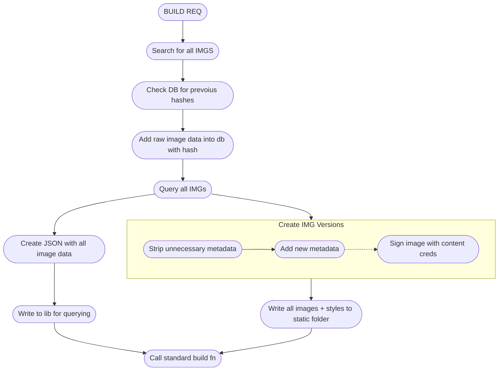

# Public assets
This folder contains all the uncompressed assets in the anderson productions website ideally using bazel and build steps we should be able to keep images managable and also attach extra metadata....

